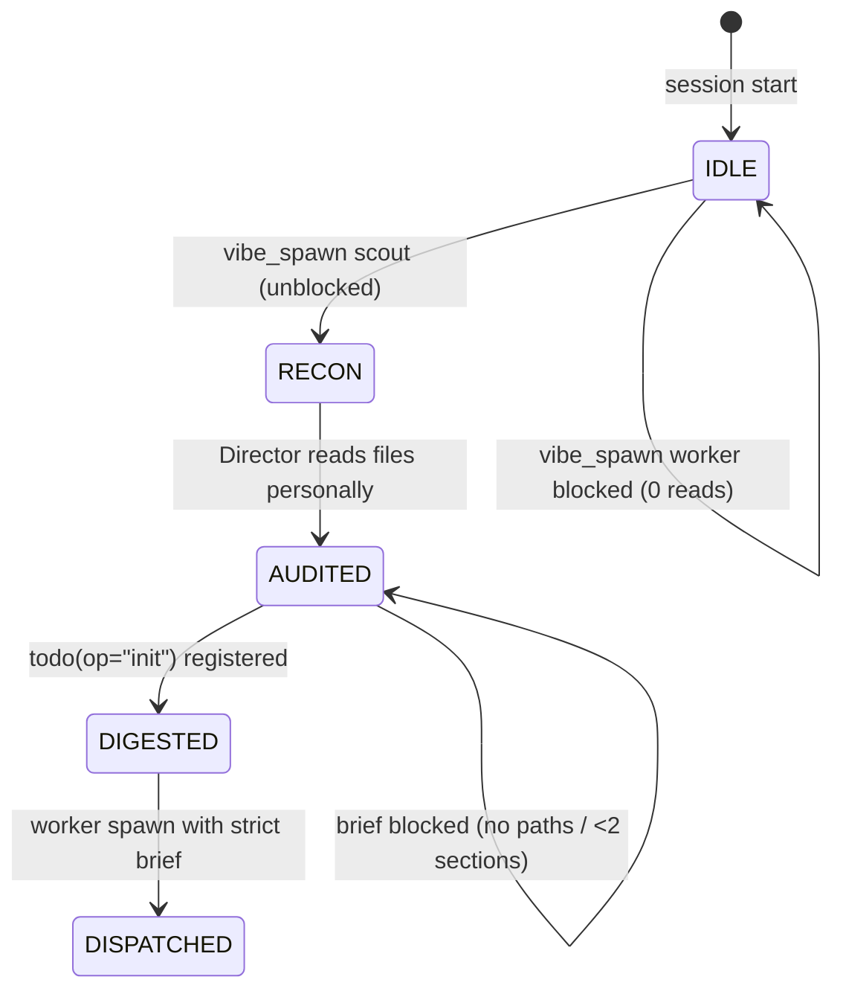

# OMP Vibe Kit

**OMP Vibe Kit is the Anti-Slop Guard for Oh My Pi (OMP) Vibe Mode: it turns the Director from a blind delegator into a verified lead architect.**

In Vibe Mode, the Director orchestrates workers via `vibe_spawn`. Left unguarded, it delegates on guesses — hallucinated file paths, vague briefs, and scouts that were never verified. OMP Vibe Kit enforces the **Zero-Slop Director Protocol**: a strict 4-phase pipeline that makes blind delegation structurally impossible.

- **Prompt rewrite:** replaces the stock `vibe-mode-context` system prompt with the Zero-Slop Execution Pipeline on every LLM call.
- **Verified-read tracking:** counts the Director's own `read` calls — delegation requires personal inspection, not scout hearsay.
- **Recon passthrough:** reconnaissance scouts (`recon-*`, `scout-*`, `RECON:` prompts, fast-tier keyword workers) dispatch immediately, with no brief bureaucracy.
- **Preflight gating:** implementation workers are blocked with actionable `SLOP_GUARD_BLOCKED` reasons until the brief cites verified file paths and structured sections.
- **Zero dependencies:** the shipped `dist/extension.js` is a single self-contained bundle — no runtime packages, no subprocesses, purely in-process EventBus hooks.

## The Zero-Slop Director Protocol



| Phase | Gate | What the Director must do |
| ----- | ---- | ------------------------- |
| 1. Reconnaissance | — | Spawn a `fast` scout (`recon-<topic>`) to map files, signatures, and data flow. |
| 2. Adversarial Audit | `directorReadCount > 0` | Personally `read` the files the scout reported. Scouts hallucinate; bytes do not. |
| 3. Master-TODO Synthesis | `todo(op="init")` | Digest verified facts into the parent checklist before dispatching. |
| 4. Grounded Dispatch | file paths + ≥2 brief sections | Spawn workers only with the Strict Brief Contract below. |
| 5. Result Verification | — | Re-`read` touched files; never trust a worker's verbal claim. |

## How it works

The extension registers two hooks on the OMP EventBus:

- **`context`** — scans outbound messages for `customType === "vibe-mode-context"` and rewrites its content to the Zero-Slop Execution Pipeline. All other messages pass through untouched.
- **`tool_call`** — increments a session-scoped `directorReadCount` on `read`, tracks `todo(op="init")`, and preflights every `vibe_spawn`. Every other tool (`bash`, `edit`, `write`, `grep`, `glob`, `task`, `vibe_kill`, `vibe_send`, `vibe_wait`, `vibe_list`, …) returns unmodified.

### Scout classification (prefix-first)

A spawn is a reconnaissance scout when **any** tier matches:

1. **Name prefix** — `recon-*`, `scout-*`, `search-*`, `audit-*`, `inspect-*` (case-insensitive).
2. **Prompt declaration** — the prompt opens with `RECON:`, `SCOUT:`, `SEARCH:`, `AUDIT:`, `DISCOVERY:`, or `INVESTIGATE:`.
3. **Fast tier + keywords** — `cli: "fast"` with a recon keyword (`recon|scout|search|audit|find|explore|locate|investigate|inspect|census`) in the name or the first 300 chars of the prompt, **unless** the name carries a builder token (`build|impl|fix|patch|core|refactor|coder`…).

Negative constraints (`"do NOT build"`) and branch names (`feat/prompt-refusal-rewrite`) never disqualify a scout — classification is prefix-first, never a full-text action-verb scan.

### Worker gates

A non-scout `vibe_spawn` must pass three gates, in order:

1. **Verified read** — `directorReadCount > 0`.
2. **Concrete file paths** — the prompt matches a filesystem path with extension (POSIX and Windows `C:\…` backslashes).
3. **Structured brief** — at least two section headers from `## Target Files`, `## Current Contract`, `## Required Delta`, `## Acceptance Criteria`, `## Anti-Slop Non-Goals`, `## Verification`.

Every rejection returns an actionable `SLOP_GUARD_BLOCKED` reason naming the failed gate and the fix — including a hint to rename the worker `recon-<topic>` if it was meant as a scout.

## Strict Brief Contract

**Blocked** — no verified reads, no paths, no structure:

```text
vibe_spawn { cli: "good", name: "impl-x", prompt: "refactor the auth module" }
→ SLOP_GUARD_BLOCKED: Director has not read or verified any repository files!
```

**Blocked** — paths but no structure:

```text
vibe_spawn { cli: "good", name: "impl-x", prompt: "## Target Files\nsrc/auth.ts — fix it" }
→ SLOP_GUARD_BLOCKED: Implementation brief lacks structured specification.
```

**Allowed** — verified reads + paths + ≥2 sections:

```text
vibe_spawn {
  cli: "good",
  name: "impl-auth",
  prompt: "## Target Files\nsrc/auth/session.ts\n## Current Contract\nvalidate(token): boolean\n## Required Delta\nadd expiry check\n## Acceptance Criteria\nbun test passes"
}
→ permitted
```

**Allowed** — scout, no ceremony:

```text
vibe_spawn { cli: "fast", name: "recon-auth", prompt: "Search the repo for auth flow. Do NOT edit code." }
→ permitted immediately
```

## Installation

### Marketplace

```bash
omp plugin marketplace add https://github.com/stgmt/omp-vibe-kit
omp plugin install omp-vibe-kit@omp-vibe-kit --scope user
```

### Git pin

Pin a release in `~/.omp/plugins/package.json`:

```json
{
  "dependencies": {
    "omp-vibe-kit": "github:stgmt/omp-vibe-kit#v0.1.0"
  }
}
```

### Multi-profile install

OMP isolates named profiles. From a checkout, link the plugin into the default profile and every `~/.omp/profiles/*` profile:

```bash
bun run install-global    # node scripts/install-all-profiles.mjs
bun run uninstall-global  # node scripts/uninstall-all-profiles.mjs
```

Restart OMP after installing or upgrading.

## Development

```bash
bun run build          # bundle src/index.ts → dist/extension.js (minified ESM)
bun test               # full test pyramid
bun run test:unit      # classifier unit tests
bun run test:regression # non-vibe pass-through proofs
bun run test:edge      # edge cases (Windows paths, negative constraints, …)
bun run test:mutation  # proves every gate check is load-bearing
bun run test:e2e       # live ExtensionRunner chain via installed pi-coding-agent
bun run test:all       # build + full pyramid
```

The e2e suite loads `dist/extension.js` through the real OMP extension loader and drives it through a real `ExtensionRunner` — the same dispatch path the agent loop uses. It resolves the runtime from `OMP_RUNTIME_ROOT` or `~/.omp/plugins/node_modules/@oh-my-pi/pi-coding-agent`.

## Compatibility

- **OMP** v17.3.7 and later — no core monkey-patching, official EventBus hooks only.
- **Windows, Linux, macOS** — path gate handles both `/` and `\` separators.
- **Fail-safe open** — outside Vibe Mode, or for any non-`vibe_spawn` tool, the extension is inert.

## License

MIT
