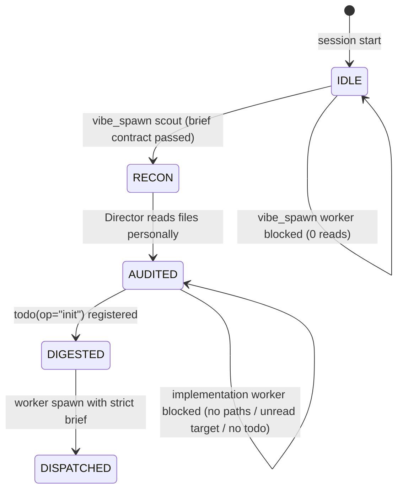

# OMP Context Kit

**OMP Context Kit is the Anti-Slop Guard for Oh My Pi (OMP) Vibe Mode: it turns the Director from a blind delegator into a verified lead architect.**

In Vibe Mode, the Director orchestrates workers via `vibe_spawn`. Left unguarded, it delegates on guesses — hallucinated file paths, vague briefs, and scouts that were never verified. OMP Context Kit enforces the **Zero-Slop Director Protocol**: a strict five-phase pipeline that makes blind delegation structurally impossible.

- **Prompt rewrite:** replaces the stock `vibe-mode-context` system prompt with the Zero-Slop Execution Pipeline on every LLM call.
- **Verified-read tracking:** records the normalized paths of the Director's own `read` calls — delegation requires personal inspection, not scout hearsay.
- **Recon passthrough:** reconnaissance scouts (`recon-*`, `scout-*`, `RECON:` prompts, fast-tier keyword workers) bypass implementation-only read, target-path, and Master-TODO gates, but must pass the complete six-section brief contract.
- **Preflight gating:** every spawn is blocked with actionable `SLOP_GUARD_BLOCKED` reasons for an incomplete six-section brief; implementation workers must also cite a file the Director read and wait for the Master-TODO.
- **Zero dependencies:** the shipped `dist/extension.js` is a single self-contained bundle — no runtime packages, no subprocesses, purely in-process EventBus hooks.

## The Zero-Slop Director Protocol



| Phase | Gate | What the Director must do |
| ----- | ---- | ------------------------- |
| 1. Reconnaissance | — | Spawn a `fast` scout (`recon-<topic>`) to map files, signatures, and data flow. |
| 2. Adversarial Audit | `readPaths` non-empty | Personally `read` the files the scout reported. Scouts hallucinate; bytes do not. |
| 3. Master-TODO Synthesis | `todo(op="init")` or `op="start"` | Digest verified facts into the parent checklist before dispatching. |
| 4. Grounded Dispatch | complete six-section brief; implementations also require cited path ∈ `readPaths` + Master-TODO | Spawn workers only with the Strict Brief Contract below. |
| 5. Result Verification | — | Re-`read` touched files; never trust a worker's verbal claim. |

## How it works

The extension registers two hooks on the OMP EventBus:

- **`context`** — scans outbound messages for `customType === "vibe-mode-context"` and rewrites its content to the Zero-Slop Execution Pipeline. All other messages pass through untouched.
- **`tool_call`** — records normalized `read` paths (full path + basename), tracks `todo(op="init"|"start")`, and preflights every `vibe_spawn`. Every other tool (`bash`, `edit`, `write`, `grep`, `glob`, `task`, `vibe_kill`, `vibe_send`, `vibe_wait`, `vibe_list`, …) returns unmodified.

### Scout classification (prefix-first)

A spawn is a reconnaissance scout when **any** tier matches:

1. **Name prefix** — `recon-*`, `scout-*`, `search-*`, `audit-*`, `inspect-*` (case-insensitive).
2. **Prompt declaration** — the prompt opens with `RECON:`, `SCOUT:`, `SEARCH:`, `AUDIT:`, `DISCOVERY:`, or `INVESTIGATE:`.
3. **Fast tier + keywords** — `cli: "fast"` with a recon keyword (`recon|scout|search|audit|find|explore|locate|investigate|inspect|census`) in the name or the first 300 chars of the prompt, **unless** the name carries a builder token (`build|impl|fix|patch|core|refactor|coder`…).

Negative constraints (`"do NOT build"`) and branch names (`feat/prompt-refusal-rewrite`) never disqualify a scout — classification is prefix-first, never a full-text action-verb scan.

### Worker gates

Every `vibe_spawn` must pass the complete-brief contract first. Non-scouts then pass four implementation gates in order:

1. **Verified read** — the Director has read at least one file this session.
2. **Concrete file paths** — the prompt matches a filesystem path: either a path with a separator (`/` or \), incl. Windows `C:\…`) or a bare filename with a recognized code/doc extension (`ts`, `py`, `md`, `json`, …). Dotted non-paths like `5.00pm`, `v1.0`, `section 2.4` are rejected.
3. **Targeted read intersection** — at least one cited path (or its basename) was personally `read` by the Director. Reading `src/auth.ts` does not authorize a brief that only cites `src/billing.ts`.
4. **Master-TODO initialized** — `todo(op="init")` or `todo(op="start")` has run.

Brief-contract rejections name every missing or invalid section; implementation-gate rejections name the failed check and its fix. The read-gate message includes a scout hint when relevant.

## Strict Brief Contract

Every vibe_spawn prompt, including reconnaissance scouts, must contain all six required level-two headings: Goal, Done when, Scope / Non-goals, Evidence, Checkpoint, and Dependencies. Each section must be non-empty and concrete; duplicate headings, blank bodies, and placeholder text block the spawn. Checkpoint needs a positive elapsed duration after spawn. Dependencies may contain only None when there are no prerequisites. For implementation workers, put concrete targets under Scope / Non-goals; at least one cited path must have been read by the Director.

The gate reports every missing or invalid section and never fills it in. Scouts bypass implementation-specific read, target-path, and Master-TODO gates, not the brief contract.

**Blocked** — incomplete brief (the gate enumerates every missing heading):

```text
## Goal
Fix session expiration handling.
## Scope / Non-goals
src/auth/session.ts
```

**Allowed** — complete implementation brief, after the Director has read src/auth/session.ts and initialized the Master-TODO:

```text
## Goal
Reject expired sessions without changing valid-session behavior.
## Done when
Expired sessions are rejected, valid sessions remain accepted, and the focused tests pass.
## Scope / Non-goals
In scope: src/auth/session.ts and tests/auth/session.test.ts.
Out of scope: token-format changes and unrelated authorization flows.
## Evidence
Run bun test tests/auth/session.test.ts and report the observed result.
## Checkpoint
At 15 minutes after spawn, report status; continue monitoring until terminal.
## Dependencies
None.
```

**Allowed** — complete read-only scout brief; scouts still need all six sections:

```text
## Goal
Map the authentication flow and its entry points.
## Done when
The verified entry points and high-level flow are reported.
## Scope / Non-goals
Read-only discovery of authentication code; do not edit files.
## Evidence
Cite verified paths, signatures, and data flow; label unknowns explicitly.
## Checkpoint
At 10 minutes after spawn, report status; continue monitoring until terminal.
## Dependencies
None.
```


## Installation

### Marketplace

```bash
omp plugin marketplace add https://github.com/stgmt/omp-context-kit
omp plugin install omp-context-kit@omp-context-kit --scope user
```

### Git pin

Pin a release in `~/.omp/plugins/package.json`:

```json
{
  "dependencies": {
    "omp-context-kit": "github:stgmt/omp-context-kit#v0.2.0"
  }
}
```

### Multi-profile install

OMP isolates named profiles. From a checkout, link the plugin into the default profile and every `~/.omp/profiles/*` profile:

```bash
bun run install-global    # node scripts/install-all-profiles.mjs
bun run uninstall-global  # node scripts/uninstall-all-profiles.mjs
```

Restart OMP after installing or upgrading.

## Development

```bash
bun run build          # bundle src/index.ts → dist/extension.js (minified ESM)
bun test               # full test pyramid
bun run test:unit      # classifier unit tests
bun run test:regression # non-vibe pass-through proofs
bun run test:edge      # edge cases (Windows paths, negative constraints, …)
bun run test:mutation  # proves every gate check is load-bearing
bun run test:e2e       # live ExtensionRunner chain via installed pi-coding-agent
bun run test:all       # build + full pyramid
```

The e2e suite loads `dist/extension.js` through the real OMP extension loader and drives it through a real `ExtensionRunner` — the same dispatch path the agent loop uses. It resolves the runtime from `OMP_RUNTIME_ROOT` or `~/.omp/plugins/node_modules/@oh-my-pi/pi-coding-agent`.

## Compatibility

- **OMP** v17.3.7 and later — no core monkey-patching, official EventBus hooks only.
- **Windows, Linux, macOS** — path gate handles both `/` and `\` separators.
- **Fail-safe open** — outside Vibe Mode, or for any non-`vibe_spawn` tool, the extension is inert.

## License

MIT
